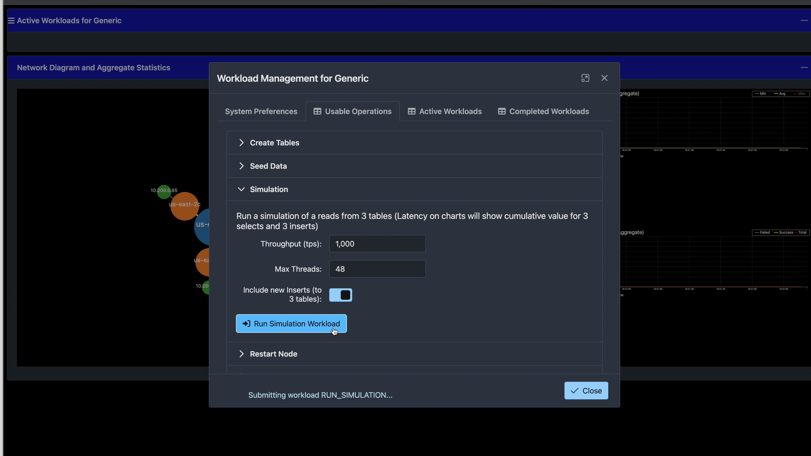
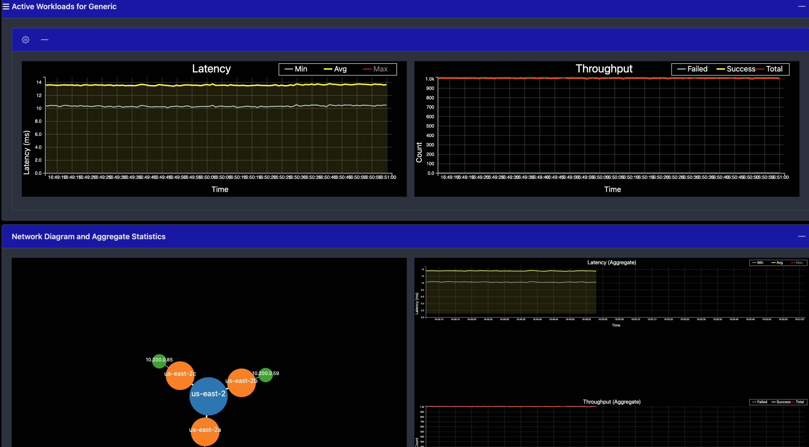

## What is yb-simulation-base-demo-app
This is our base app containing some generic workloads. You can create/drop tables for a workload, load data, run different simulations all from UI. Web page provides you with live latency and throughput about your yugabyte db cluster while these simulations are running. This repo acts as a base and you can extend it to write your specific simulations. I will be providing some starter projects/instructions for that soon. 

## Code setup and Installation

### How to build the jar file
Go to the root of the project and run:
```
mvn clean package -DskipTests
```
This will create the jar file: <yb-simulation-base-demo-app>/target/yb-simulation-base-app.jar

### How to run this App

Here is the basic command. You can pass additional parameters as needed:

```
java -DXmx=16g -Dmax-pool-size=10 -Dnode=<database-ip-or-name> -Ddbuser=<db-user-id> -Ddbpassword=<db-password> -Dspring.datasource.hikari.data-source-properties.topologyKeys=<cloud.region.zone> -Dspring.workload=genericWorkload -jar yb-simu-base-app.jar
```

#### Parameters you can add to above java command: 
```
-Dnode=<database-host-name> [default: 127.0.0.1]
-Ddbuser=<userid> [default: yugabyte]
-Ddbpassword=<password> [default: yugabyte]
-Dport=<port> [default: 5433 - database port if using other than 5433]
-Dmax-pool-size=<max-pool-size> [default: 100]
-Ddbname=<dbname> [default: yugabyte]
-Dworkload=<workload-id> [ default: genericWorkload ]
-Dspring.datasource.hikari.data-source-properties.topologyKeys=<cloud.region.zone> [ex. aws.us-east-2.us-east-2a,aws.us-east-2.us-east-2b,aws.us-east-2.us-east-2c]
-Dspring.profiles.active=<profile> [default: application.yaml]
-Dserver.port=<app-ui-port> [default: 8080]
-Dssl=true [default: false]
-Dsslmode=verify-full [default: disable]
-Dsslrootcert=<certificatepath> 
```

#### Parameters for Yugabyte Cloud - These will provide the ability to start/stop nodes and scale cluster from App UI:

```
-Dybm-account-id=<YBM Account Id>
-Dybm-api-key=<YBM API Key>
-Dybm-project-id=<YBM Project Id>
-Dybm-cluster-id=<YBM Cluster Id>
```

#### Additional parameters if you wish to run YCQL workload
```
-Dworkload=genericCassandraWorkload
-Dspring.data.cassandra.contact-points=<host ip> 
-Dspring.data.cassandra.port=9042 
-Dspring.data.cassandra.local-datacenter=<datacenter> [ex. us-east-2 ]
-Dspring.data.cassandra.userid=cassandra 
-Dspring.data.cassandra.password=<cassandra-password>
```

## How to run locally
Here are the steps to get the demo application to run on your local machine, starting with Yugabyte.
Have Yugabyte installed on your local machine: https://docs.yugabyte.com/preview/quick-start/.
Open a total of 3 IP addresses to be able to run Yugabyte with a replication factor of 3
Use this command:
```
sudo ifconfig lo0 alias 127.0.0.2
sudo ifconfig lo0 alias 127.0.0.3
```
Go into the Yugabyte directory to start a 3 node cluster locally with the following command 
```
./bin/yb-ctl --rf 3 create 
```
To verify that Yugabyte is up and running you can run the command
```
./bin/yb-ctl status
```
Please have Java installed on your local machine. Here is a link to help with that process. Second link if you do not have an Oracle account 

https://www.youtube.com/watch?v=FsX0_RXMwvY


https://dev.to/docker/how-to-setup-java-on-macos-124-monterey-3l10


To verify you have Java installed please run this command:
```
java -version
```
For this demo we also need to install Maven, here is a link I have found helpful to install Maven on a Mac M1 computer.
https://www.youtube.com/watch?v=kCQKh_CscYA

To confirm you have successfully install Maven on your Mac please use the command
```
mvn -v
```


Here is an **example invocation** using the defaults from `yb-ctl`:

```bash
java -DXmx=16g -Dmax-pool-size=10 -Dnode=localhost -Ddbuser=yugabyte -Ddbpassword=yugabyte \
    -Dspring.datasource.hikari.data-source-properties.topologyKeys=cloud1.datacenter1.rack1 \
    -Dspring.workload=genericWorkload -jar target/yb-simu-base-app.jar
```

The GUI is visible at http://localhost:8080

## How to build your own workload
Download the zip file

### How to build the App
Go to the root of the project and run:
```
./mvnw spring-boot:run -Dspring-boot.run.profiles=dev
```
This will create the jar file: <yb-simulation-base-demo-app>/target/yb-simulation-base-app.jar
You can also get the jar file in VS Code by right clicking the "WorkloadSimulationApplication.java" file and selecting Run Java
  


Then you can verify the name of the "jar" file by going to the target directory, use the name of that file where ever you see "yb-simulation-base-app.jar"


Now you can go to http://localhost:8080 and you will see this


From here you can select the “hamburger” menu at the top and simulate your own workload!

Now go back to your terminal and within the Yugabyte folder (the same place where you started the node cluster). And you can stop a node by executing the following command 
```
./bin/yb-ctl stop_node 2
```


As you can see there is a slight drop when the node is stopped and then it just keeps going!
  


Note: The Stop node button is still in Beta at the time of this documentation. 

You should have Yugabyte “stopped” on your local machine. If you followed the steps above you should restart node 2 by typing 
```
./bin/yb-ctl start_node 2
```
  
Next we need to stop the cluster: 
```
./bin/yb-ctl stop
```

## How to setup YBA Environment
### How to run this App
This is a walk through of how to get the Demo Up in a YBA (Yugabyte Anywhere UI) environment in AWS. Here is a link to the repo: https://github.com/yugabyte/yb-simulation-base-demo-app

The first thing that is needed is for you to complete the steps above in order to create the “jar” file. After that there will be a “yb-simu-base-app.jar” file in the “target” directory of the “yb-simulation-base-demo-app-main” folder 

Lets go over some prerequisites: You need everything above including Java, Maven, and Yugabyte installed on your local machine. It should be noted that if this is your first time using the AWS pem file you need to change the permistions of the .pem file with the following command:
  
```
chmod 400 <name of your .pem file>
```


 


 
To successfully follow along with this demo please make sure you have an YBA set up in AWS. If you need help with that please follow these instructions: 
https://docs.google.com/presentation/d/1LbmaLWURFNc4f4pv2KUSntE8eDf6ohbk/edit#slide=id.p13

You should have an environment that looks like this: IP addresses excluded for security.


Now we can get started with running the simulation demo

The first thing we need to do is to move the “jar” file from our local directory onto the ec2 instance. You can do this from the directory the jar file is located in on your local machine or move it to the current working directory. Then we can move it with the following command: 
```
scp -i <path to your pem file> <name of the jar file> ec2-user@<IP address of the YBA>:/tmp/
```


Please note the above is an example and replace all the parameters of what you need to access your YBA instance with your own credentials. Pem location, file name, ip address.

There are two ways to launch the application from inside your EC2 instance. You can launch it with the following command inside the terminal:
  
First install java on the machine: 
```
sudo yum install java
```
Navigate to your tmp directory and use ```mkdir logs``` to make a log file in case there are any errors during the set up. 
Then execute the commands below in the terminal or navigate to your tmp directory and secret an executable script. Note the Dnode IP address should be that of one in your AWS cluster

 
EXAMPLE  
  

  
 Code
 ```
 java -DXmx=32g -Dspring.datasource.hikari.maximumPoolSize=100 -DloggingDir="/tmp/logs"\
-Dnode=<Your Node IP address>\
-Ddbuser=<Your username> Default:yugabyte \
-Ddbpassword=<Your password> Default:yugabyte \
-Dport=5433 \
-Dmax-pool-size=100 \
-Ddbname=yugabyte \
-Dspring.profiles.active=application.yaml \
-Dserver.port=8080 \
-DidCounter=1 \
-Dssl=false <unless you enabled it> \
-Dsslmode=disable \
-Dworkload=genericWorkload \
-DadditionalEndpoints= \
-jar yb-workload-simu-app.jar
 ```
You can also use this code to specify the AWS regions:
```  
java -DXmx=16g -Dmax-pool-size=10 -Dnode=<your node IP> -Ddbuser=yugabyte -Ddbpassword=<Your password> -Dspring.datasource.hikari.data-source-properties.topologyKeys=<Your AWS regions/zones> Example:aws.us-east-1.us-east-1a,aws.us-east-1.us-east-1b,aws.us-east-1.us-east-1c -Dspring.workload=genericWorkload -DadditionalEndpoints= -jar yb-simu-base-app.jar
```
  
The second way to do this is to make an executable script with the command above in case you wish to rerun the command. To do that you can copy and paste the code into a .sh file here is an example: ```touch run.sh``` then make the file executable by typing ```chmod 700 run.sh.``` Then you can execute it by typing ```./run.sh```

Now we can navigate to the IP of the YBA cluster(not the IP of the node)with the port 8080.


  
  
  
  
  
  ```
java -DXmx=16g -Dmax-pool-size=10 -Dnode=<database-ip-or-name> -Ddbuser=<db-user-id> -Ddbpassword=<db-password> -Dspring.datasource.hikari.data-source-properties.topologyKeys=<cloud.region.zone> -Dspring.workload=genericWorkload -jar yb-simu-base-app.jar
```
  
To try other work loads you can replace the genericWorkload from -Dworkload= line with any other workload from this section src>>main>java>com>yugabyte>simulation>service https://github.com/yugabyte/workload-simulation-demo-app/tree/main/src/main/java/com/yugabyte/simulation/service

#### Additional parameters if you wish to run YCQL workload (Please remember to move the <-jar yb-simu-base-app.jar> to the last line fo the script. Everything after that line gets ignored)
```
-Dworkload=genericCassandraWorkload
-Dspring.data.cassandra.contact-points=<host ip> 
-Dspring.data.cassandra.port=9042 
-Dspring.data.cassandra.local-datacenter=<datacenter> [ex. us-east-2 ]
-Dspring.data.cassandra.userid=cassandra 
-Dspring.data.cassandra.password=<cassandra-password>
```

#### Local Environment: 
```
./mvnw spring-boot:run -Dspring-boot.run.profiles=dev
```

### Prod APP UI: 
```
http://<HOSTNAME>:8080
```



  
  
  
## Create your own workload .java file
You can copy and paste the "GenericWorkload.java" file into a new file, name of your choosing (The development team behind this app would like consistancy in the naming so please add Workload" to the tail of your name). My demo is named "InstructionsWorkload.java". 


  
There are 3 "FIX ME" sections to change the name of the class after you copy and paste the "GenericWorkload.java" file. 
  


  
To be able to call the new workload you have to modify the "WorkloadConfig.java" file found here:
src/main/java/com/yugabyte/simulation/config


  


 After this you can run the "WorkloadSimulationApplication.java" as a java file:
 


This will create a new "jar" file in your target directory.


You should now be able to run the code with the following command(code from line 136 above): 
  

  
Navigate to http://localhost:8080 and you will see or the IP of the machine you are using:
  


